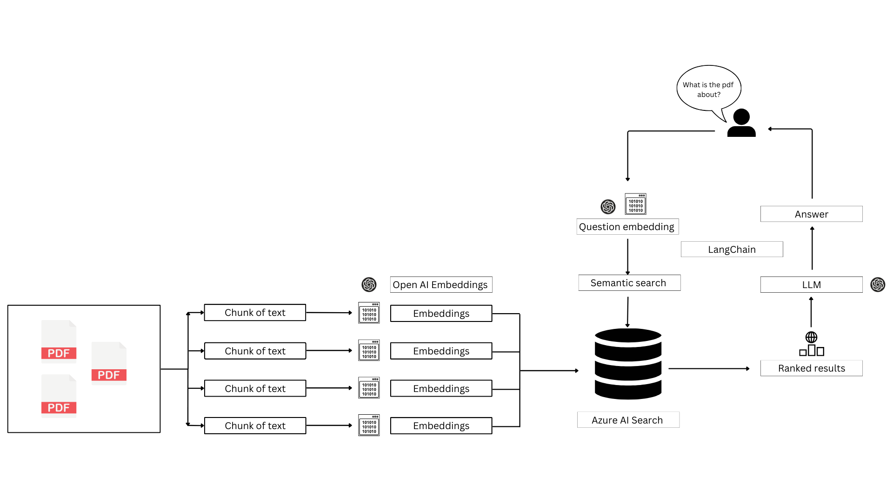

## StudyBuddy: An Intelligent Education App

StudyBuddy is an innovative educational application designed to streamline classroom management and enhance student engagement through intelligent digital interactions. It offers a range of features including class creation, FAQ management, file uploads for teachers, and interactive class joining and FAQ interactions for students.

## How it Works

StudyBuddy operates through a user-friendly interface, allowing teachers to create classes, manage FAQs, and upload files. Students can join classes using a class code and interact with the FAQs and chatbot.

### Technical Details

The application is structured with modularity in mind. Each feature, such as user authentication (`LOGIN.py`), dashboard management (`DASHBOARD.py`), FAQ handling (`__faqs.py`), and others, is encapsulated in its own script. This modular approach not only makes the codebase easier to navigate but also simplifies maintenance and future enhancements.

Modules are imported efficiently, ensuring that each script only loads the necessary dependencies. This reduces the app's overall memory footprint and improves performance. For instance, `sessionvars.py` is crucial for maintaining user state across the application and is imported in scripts where session management is required. Similarly, `azsqldb.py` handles all interactions with the Azure SQL Database and is imported in modules requiring database access.

### Prerequisites

#### Azure Services
- [Azure Open AI](https://azure.microsoft.com/en-us/services/cognitive-services/openai-service/)
- [Azure SQL Database](https://azure.microsoft.com/en-us/services/sql-database/)
- [Azure AI Search](https://azure.microsoft.com/en-us/services/search/)

Create an Azure account [here](https://azure.microsoft.com) if you do not already have one.

#### Required Packages
Run `pip install -r requirements.txt` in your terminal to install necessary packages.

#### Python Environment
Configure a `.env` file in the root directory with the following variables:

OPENAI_API_KEY= Your API key for Open AI services
AZURE_SERVER= The server address for your Azure SQL Database
AZURE_DATABASE= The name of your Azure SQL database
AZURE_USERNAME= Your username for Azure SQL Database
AZURE_PASSWORD= Your password for Azure SQL Database
AZURE_AI_SEARCH_API_KEY= Your API key for Azure AI Search services
AZURE_AI_SEARCH_ENDPOINT= The endpoint URL for Azure AI Search services

### Features and Modules

#### `LOGIN.py`
Manages user authentication, redirecting to the appropriate interface based on user role (teacher/student).

#### `DASHBOARD.py`
Serves as the core interface after login, presenting a dashboard for class selection, and viewing schedules.

#### `__faqs.py`
Facilitates a dynamic FAQ section where teachers can add/edit FAQs, and students can view and add new questions.

#### `chatbot.py`
An AI-driven chatbot for real-time assistance, powered by [Azure Open AI](https://azure.microsoft.com/en-us/services/cognitive-services/openai-service/).

#### `__sidebar.py`
Provides a navigational sidebar for easy access to different sections of the app.

#### `__fileupload.py`
Enables file uploading for assignments or educational materials.

#### `azsqldb.py`
Handles interactions with [Azure SQL Database](https://azure.microsoft.com/en-us/services/sql-database/) for data storage and retrieval.

#### `sessionvars.py`
Manages session variables for maintaining state across the application.

## Deployment

Run `streamlit run login.py` to deploy the app locally. For more information on Streamlit, visit [Streamlit's documentation](https://docs.streamlit.io).

## Built With

- [Streamlit](https://streamlit.io) - The framework used to build the app.

## License

This project is licensed under the MIT License - see the [LICENSE.md](LICENSE.md) file for details.

